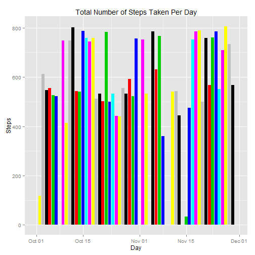
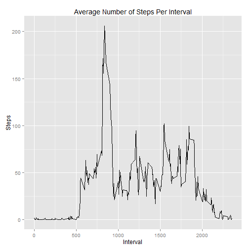
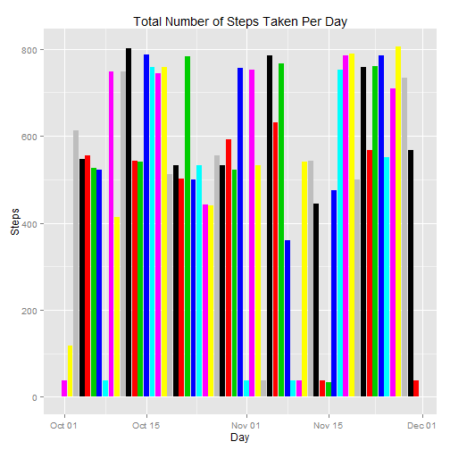
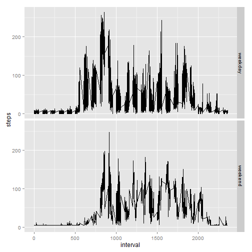

title: "Reproducible Research Assessment1"
author: "Praneeth"
date: "October 12, 2015"
output: html_document


### Donwload and Process the Required Data


```r
if(!file.exists("repdata-data-activity.zip")) {
  setInternet2(use = TRUE) 
        temp <- tempfile()
        
download.file("https://d396qusza40orc.cloudfront.net/repdata%2Fdata%2Factivity.zip",temp)
        unzip(temp)
        unlink(temp)
        

activity_raw <- read.csv("activity.csv",header = TRUE,stringsAsFactors = FALSE)
activity_data <- transform(activity_raw,date = as.Date(date,"%Y-%m-%d"))

activity_data <- data.frame(date=activity_data$date, 
                           weekday=tolower(weekdays(activity_data$date)), 
                           steps=activity_data$steps, 
                           interval=activity_data$interval)
activity_data <- transform(activity_data,daytype = 
                                    ifelse(activity_data$weekday == "saturday" | 
                                     activity_data$weekday == "sunday", "weekend", 
                                     "weekday"))	        
}
```

### What is mean total number of steps taken per day?


```r
library(ggplot2)

ggplot(activity_data, aes(x=date,y=steps,fill=date))+
      geom_histogram(stat="identity",position="dodge") +
	  xlab("Day") +
	  ylab("Steps") +
	  ggtitle("Total Number of Steps Taken Per Day")
```

 

```r
stepsPerDay <- aggregate(steps ~ date, activity_data,sum,na.action = na.omit)

stepsPerDayMean <- mean(stepsPerDay$steps)

stepsPerDayMedian <- median(stepsPerDay$steps)

stepsPerDayMean
```

```
## [1] 10766.19
```

```r
stepsPerDayMedian
```

```
## [1] 10765
```

### What is the average daily activity pattern?


```r
interval_Mean_Data <- aggregate(steps ~ interval,activity_data, mean,na.action = na.omit)


ggplot(interval_Mean_Data, aes(x=interval,y=steps))+
      geom_line() +
	  xlab("Interval") +
	  ylab("Steps") +
	  ggtitle("Average Number of Steps Per Interval")
```

 

```r
max_steps <- which(interval_Mean_Data$steps == max(interval_Mean_Data$steps))


max_interval <- interval_Mean_Data[max_steps, 1]	
 
max_interval
```

```
## [1] 835
```

### Imputing missing values


```r
 na_Count <- sum(is.na(activity_data$steps))
 na_obs <-  which(is.na(activity_data$steps))
 
 def_value <- rep(mean(activity_data$steps, na.rm=TRUE), times=length(na_obs))
 
 activity_data[na_obs, "steps"] <- def_value
 
 sum_data <- aggregate(steps~date, activity_data,sum)
 
ggplot(activity_data, aes(x=date,y=steps,fill=date))+
       geom_histogram(stat="identity",position="dodge") +
	   xlab("Day") +
	   ylab("Steps") +
	   ggtitle("Total Number of Steps Taken Per Day")
```

 

```r
stepsPerDayMean <- mean(sum_data$steps)

stepsPerDayMedian <- median(sum_data$steps)

stepsPerDayMean
```

```
## [1] 10766.19
```

```r
stepsPerDayMedian
```

```
## [1] 10766.19
```

### Are there differences in activity patterns between weekdays and weekends?


```r
mean_data <- aggregate(steps ~
                       daytype +
                       weekday +
					   interval, activity_data,mean)

ggplot(mean_data, aes(x=interval,y=steps,fill=daytype)) +
      geom_line() +
	  facet_grid(daytype ~ .) +
      theme(legend.position="none")   
```

 

